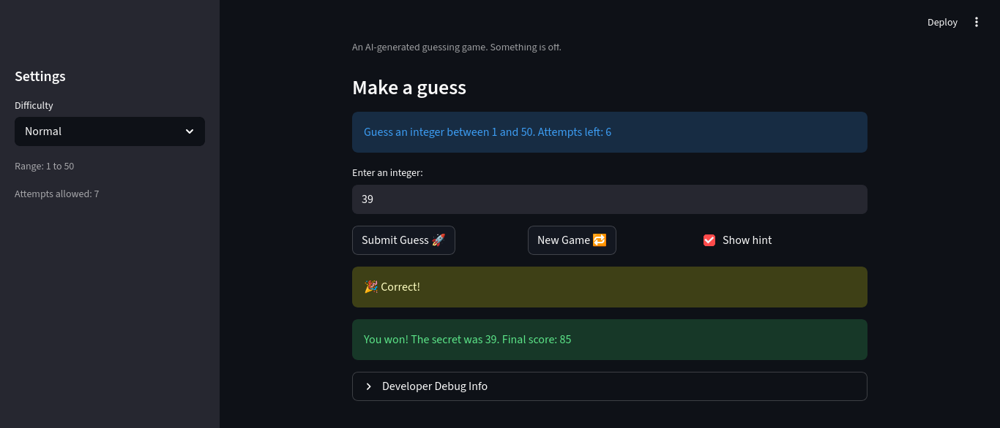
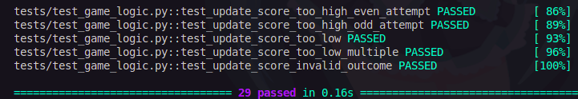

# 🎮 Game Glitch Investigator: The Impossible Guesser

## 🚨 The Situation

You asked an AI to build a simple "Number Guessing Game" using Streamlit.
It wrote the code, ran away, and now the game is unplayable. 

- You can't win.
- The hints lie to you.
- The secret number seems to have commitment issues.

## 🛠️ Setup

1. Install dependencies: `pip install -r requirements.txt`
2. Run the broken app: `python -m streamlit run app.py`

## 🕵️‍♂️ Your Mission

1. **Play the game.** Open the "Developer Debug Info" tab in the app to see the secret number. Try to win.
2. **Find the State Bug.** Why does the secret number change every time you click "Submit"? Ask ChatGPT: *"How do I keep a variable from resetting in Streamlit when I click a button?"*
3. **Fix the Logic.** The hints ("Higher/Lower") are wrong. Fix them.
4. **Refactor & Test.** - Move the logic into `logic_utils.py`.
   - Run `pytest` in your terminal.
   - Keep fixing until all tests pass!

## 📝 Document Your Experience

- This is a guessing game with score tracking, various difficulties, and hints.
- I found there was an issue with each of the above mentioned features. It was at first not possible to win max points, the logic of the difficulties being mismatched, and the hints being inaccurate. 
- To fix these issues, I made sure attempts were being initialized properly and that score tracking deducated points reasonably. I also swapped and improved the ranges and attempt counts for the difficulties. Moreover, I made sure that for the hint that the proper comparison between the guess and the secret was being made.

## 📸 Demo

 
### Pytest Results
